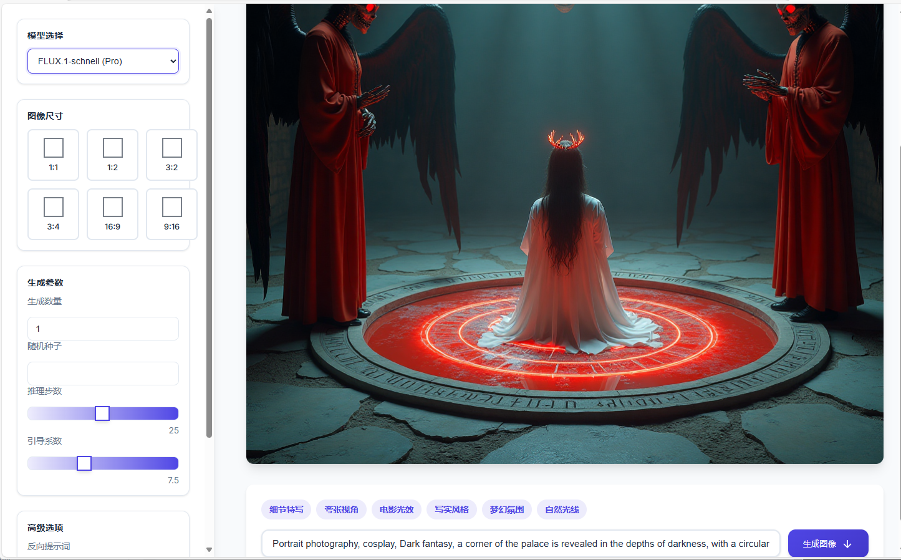

# AI 图像生成器

一个基于 Node.js 的 AI 图像生成 Web 应用，使用 Silicon Flow API 生成高质量图像。该应用提供了直观的用户界面，支持多种 AI 模型和丰富的图像生成参数控制。

## 效果展示


*应用主界面*


## 功能特点

- 支持多种 AI 模型选择
  - FLUX.1-schnell (Pro)
  - FLUX.1-schnell (Black Forest)
  - FLUX.1-dev (Black Forest)
  - Stable Diffusion 3.5 系列
  - 其他 Stable Diffusion 模型
- 灵活的图像尺寸选项
  - 支持 1:1, 1:2, 3:2, 3:4, 16:9, 9:16 等多种比例
  - 最高支持 1024x1024 分辨率
- 丰富的生成参数控制
  - 批量生成数量（1-4张）
  - 随机种子控制
  - 推理步数调节（1-50步）
  - 引导系数调整（1-20）
- 高级功能
  - 支持反向提示词
  - 提示词增强功能
  - 快捷标签选择
- 用户友好的界面
  - 响应式设计，支持移动端
  - 深色模式支持
  - 实时预览
  - 加载动画效果

## 安装说明

1. 克隆项目
```bash
git clone https://github.com/D6397/drawing.git
cd ai-image-generator
```

2. 安装依赖
```bash
npm install express cors node-fetch dotenv
```

3. 配置环境变量
   - 在项目根目录创建 `.env` 文件
   - 在 [Silicon Flow Cloud](https://cloud.siliconflow.cn/i/1hSUWxvf) 获取 API Token
   - 很多免费绘图模型 保护sd 3.5 flux1 都免费
   - 添加以下配置：
```bash
API_TOKEN=你的_SILICON_FLOW_API_TOKEN  # 从 Silicon Flow Cloud 获取
```

4. 启动服务器
```bash
node server.js
```

5. 访问应用
   - 打开浏览器访问 `http://localhost:3000`
   - 默认端口为 3000，如需修改可在 server.js 中更改

## 快速使用

1. 启动后，在浏览器中打开应用
2. 从左侧面板选择 AI 模型
3. 设置所需的图像尺寸和生成参数
4. 在底部输入框中描述你想创建的图像
5. 点击"生成图像"按钮
6. 等待图像生成完成

## 常见问题

1. 如果遇到 API 错误，请检查：
   - `.env` 文件是否正确配置
   - API_TOKEN 是否有效（可以在 [Silicon Flow Cloud](https://cloud.siliconflow.cn/i/1hSUWxvf) 查看和更新）
   - 确保 Token 以正确的格式复制（不要包含多余的空格）
   - 网络连接是否正常

2. 如果页面无法访问：
   - 确认服务器是否正常运行
   - 检查端口 3000 是否被占用
   - 查看控制台是否有错误信息

3. 如果图像生成失败：
   - 检查提示词是否合适
   - 确认选择的模型是否可用
   - 查看服务器日志获取详细错误信息

## 开发说明

- 本地开发时可以使用 nodemon 实现热重载：
```bash
npm install nodemon -g
nodemon server.js
```

- 修改端口：在 server.js 中更改 port 变量
- 调试模式：设置环境变量 DEBUG=true 可以看到详细日志
